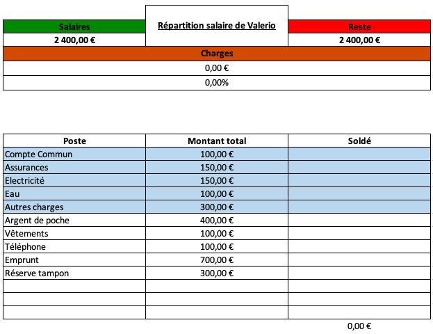

# Répartition du salaire selon les postes

Ce projet est une aide à la répartion de son salaire selon les différents postes ou charges définies au préalable.

---

## 🎬 Démonstration
  

---

## ⚡ Fonctionnalités
- Exemple de fonctionnalité 1
- Exemple de fonctionnalité 2
- Exemple de fonctionnalité 3

---

## 📊 Badges

---

## 📫 Contact
Pour toute question, contactez-moi : ton.email@example.com
